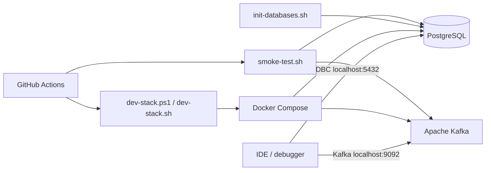

# Architecture

## Scope

The toolkit owns only local infrastructure required by application services during development. Application processes intentionally remain outside the container boundary.

## Design decisions

### Disposable infrastructure

`reset` removes named volumes before startup. This provides a deterministic local baseline and prevents stale development data from becoming an implicit dependency.

### IDE-first application execution

Application services are deliberately not part of the default Compose model. The developer can run exactly the service being changed with the preferred debugger, profiler and local environment controls.

### Configuration instead of copied service-specific scripts

The database set is declared through `DEV_DATABASES`. Synthetic defaults demonstrate the pattern without embedding organization-specific schemas or service names.

### Modern Kafka baseline

The local broker uses the official Apache Kafka image in its single-node KRaft configuration. No ZooKeeper container is required.

### Public-safe defaults

Credentials are generated into a git-ignored `.env` file. The committed repository contains no real endpoints or operational credentials.
